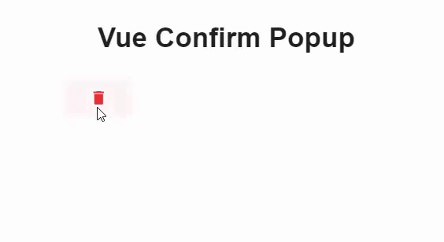

# Vue-Confirm-Popup
 É um componente de confirmação personalizável que exibe um pop-up de confirmação antes de executar ações críticas, como exclusão ou alterações permanentes. Ele é útil para prevenir ações indesejadas, fornecendo ao usuário a chance de confirmar ou cancelar a ação.
 É compativel com  Vuetify 3.x
 
## Funcionalidades
* Suporte a ícones customizáveis
*  Mensagem de confirmação personalizada
* Tooltips para botão e estado desabilitado
* Eventos de confirmação e cancelamento
*  Personalização de estilos, tamanhos e cores
 
 
## Install 
#### NPM 
Para usar o componente em seu projeto Vue 3, instale o pacote via NPM:

```bash 
npm install v-confirm-popup
``` 
## Uso
No seu projeto Vue, importe e registre o componente:

```javascript 
import { createApp } from 'vue';
import App from './App.vue';
import vuetify from './plugins/vuetify';  // if you are already using Vuetify 
import VConfirmPopup from 'v-confirm-popup';

const app = createApp(App);

app.use(vuetify);
app.component('VConfirmPopup', VConfirmPopup);
app.mount('#app');
```
## Exemplo de Uso
Você pode usar o componente da seguinte maneira:

```vue

<template>
          <v-confirm-popup class="actionsTable-icon"
          iconBtn="mdi-delete"
		  :hideLabel="true"
		  @callback="excluir"
          @callbackCancel="cancelar"
		  colorOk="red"
		  colorCancel="green"	
		  colorBtn="red">
          </v-confirm-popup>
</template>

<script>
import { defineComponent } from 'vue';

export default defineComponent({
  methods: {
             excluir() {
                console.log("Item excluído!");
              },
              cancelar() {
                console.log("Ação cancelada.");
              }
        },
});
</script>

```
#### Props
| Prop                  | Tipo    | Padrão                            | Descrição                                                 |
| --------------------- | ------- | --------------------------------- | --------------------------------------------------------- |
| `icon`                | String  | `'mdi-alert-circle-outline'`      | Ícone mostrado no `v-card`.                               |
| `label`               | String  | `'Bottom'`                        | Texto no botão ativador.                                  |
| `texto`               | String  | `'Deseja remover este registro?'` | Mensagem de confirmação.                                  |
| `btnOk`               | String  | `'Sim'`                           | Texto do botão de confirmação.                            |
| `btnCancel`           | String  | `'Não'`                           | Texto do botão de cancelamento.                           |
| `colorCancel`         | String  | `'inherit'`                       | Cor do botão de cancelar.                                 |
| `colorOk`             | String  | `'primary'`                       | Cor do botão de confirmação.                              |
| `colorBtn`            | String  | `'primary'`                       | Cor do botão ativador.                                    |
| `variant`             | String  | `'text'`                          | Variante do botão ativador (ex: `text`, `outlined`, etc). |
| `iconBtn`             | String  | `'mdi-delete'`                    | Ícone do botão ativador.                                  |
| `hideIcon`            | Boolean | `false`                           | Oculta o ícone do botão ativador.                         |
| `hideLabel`           | Boolean | `false`                           | Oculta o texto do botão ativador.                         |
| `disabled`            | Boolean | `false`                           | Desabilita o botão ativador.                              |
| `tooltip`             | Boolean | `false`                           | Ativa o tooltip do botão.                                 |
| `tooltip_texto`       | String  | `''`                              | Texto do tooltip quando ativo.                            |
| `tooltipDisabled`     | Boolean | `false`                           | Ativa tooltip quando botão está desabilitado.             |
| `tooltipDisabledText` | String  | `''`                              | Texto do tooltip quando desabilitado.                     |
| `sizeIcon`            | String  | `'default'`                       | Tamanho do ícone.                                         |
| `sizeBtn`             | String  | `'small'`                         | Tamanho do botão ativador.                                |


#### Events
| Evento            | Descrição                               |
| ----------------- | --------------------------------------- |
| `@callback`       | Emitido ao clicar em "Sim" (confirmar). |
| `@callbackCancel` | Emitido ao clicar em "Não" (cancelar).  |

#### Dicas
* Use disabled junto com tooltipDisabled para melhorar a UX de botões desabilitados.
* Integre com v-dialog, v-data-table, ou qualquer outro elemento que precise de confirmação de ações.

#### Slots
Este componente atualmente não utiliza slots.

#### Referências
* https://primevue.org/confirmpopup/ (based on primevue)
